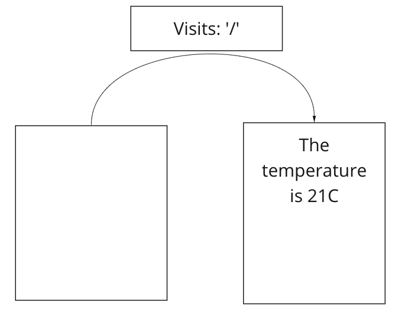

# Working with APIs

### Quickstart
```sh
# change into this project directory
$ npm install
$ npx http-server
# point your browser to the indicated localhost URL
```

### Running tests
```sh
$ npx cypress open
```

### Learning Objectives
1. Explain how to test application behaviour that consumes data from an API
2. Test-drive a simple application that consumes data from an API

### Instructions
1. Register for the [openweather API](https://home.openweathermap.org/users/sign_up)
2. Use the [domain model](#domain-model) to write a feature test
3. Create a **fixture** with data from a request to the API
4. Use `cy.intercept()` to stub the network request by providing the fixture.
5. Make your test pass!

### Domain Model

```
Given a user
When they visit the home page
Then they see the current temperature
```


### Screen Recording
- [youtube](https://youtu.be/Mxz5hvxqMNc)

### Resources
- [cypress intercept()](https://docs.cypress.io/api/commands/intercept#Stubbing-a-response)
- [test fixtures](https://stackoverflow.com/questions/12071344/what-are-fixtures-in-programming)

### Further

- [Find a second API](https://github.com/public-apis/public-apis)
- Design an update to your application that uses data from this API
- Test-drive it
